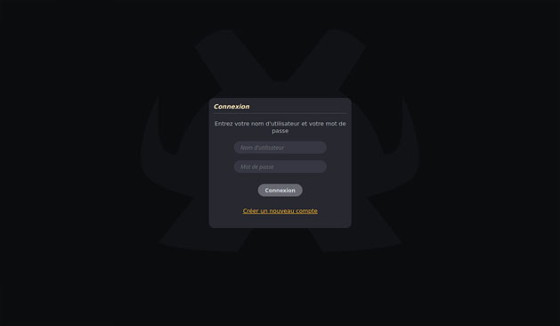
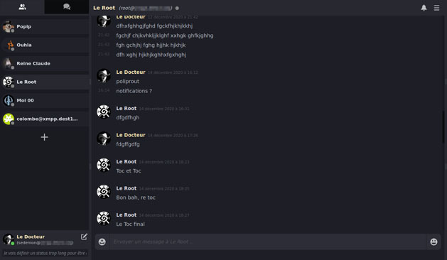
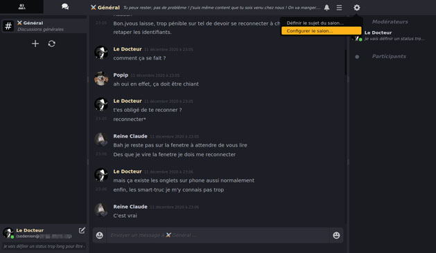

----------------------------------------------------------------------------------------
X.O.W.S
----------------------------------------------------------------------------------------

XMPP Over WebSocket

Version: 0.9.0 (beta)
----------------------------------------------------------------------------------------

Presentation
----------------------------------------------------------------------------------------
X.O.W.S (or XoWS) stands for "XMPP Over WebSocket" and is a Javascript XMPP web  client 
that use the WebSocket protocole. 

The main idea of the project is initially to create a XMPP client with the following 
caracteristics:
- Free from thirdparty library, lightweight and quick to load.
- Performant with low memory footprint.
- Allowing easy customisation and creation of graphical theme / web interface.
- Implementing features closer to modern chat clients like a one with name 
  beginning by "D".

The library is written in old fashion C-style Javascript to keep code as clear and 
optimized as possible, avoiding as most as possible Javascript false friends like the 
"this" keyword, anonymous functions, and modern Javascript syntax and confusional 
paradigms such as promises, sync and async functions features.

XMPP Client Features
----------------------------------------------------------------------------------------
- Connexion to server via WebSocket
- In-Band Registration to server.
- SASL Authentication using SAH-1, DIGEST-MD5 or PLAIN mechanism
- Message Carbons (EXP-0280)
- Message Archive Management (XEP-0313)
- User Avatar (XEP-0084)
- User Nickname (XEP-0172)
- PEP Native Bookmarks (XEP-0402)
- vCard4 Over XMPP and vcard-temp (XEP-0292, XEP-0054)
- HTTP File Upload (XEP-0363)
- Partial support for Multi-User Chat (XEP-0045)

Screenshots
----------------------------------------------------------------------------------------

The following screenshots are not up-to-date and do not reflect exactly the current 
stage of GUI.

Version history
----------------------------------------------------------------------------------------

0.9.1 (2022-05-09)
 - Refactoring of GUI Module
 - Refactoring of GUI Theme and templates
 - Adding support for PEP Native Bookmarks (XEP-0402)
 - Improved avatar and user data caching mechanisms
 - New "less angry" logo
 - Numerous bugs fixed

0.9.0 (2021-02-07)
 - First public BETA release

Library architecture
----------------------------------------------------------------------------------------

The library is divided into several "API Modules" with one file per "module", each 
"module" is dedicated to a specific aspect of the program and have a dedicated function 
name prefix except the "base API". Here is module list and their quick description:

#### Low-Level API / "Back end" (Algorithms and protocole implemenation)

- `xows_base.js` **Base API**: Base constants and functions such as string/bytes manipulation and algorithms
- `xows_xml.js`  **XML Module**: XML parsing, manipulation and building functions
- `xows_sasl.js` **SALS Module**: SASL mechanism implementation
- `xows_sck.js`  **WebSocket Module**: WebSocket interface functions
- `xows_xmp.js`  **XMPP Module**: "Low-Level" XMPP protocol client interface

####  Mid-Level API (client interface)

- `xows_cach.js` **Caching Module**: Data caching and Browser local storage management functions
- `xows_cli.js`  **Client Module**: "High-level" XMPP client interface

####  High-Level Program / "Front end" (GUI and "public" functions)

- `xows_l10n.js` **l10n Module**: Localization mechanisms and translation functions 
- `xows_tpl.js`  **HTML Templates Module**: HTML templates download and parsing mechanism
- `xows_doc.js`  **DOM Managment Module**: Browser DOM document management and GUI base tools
- `xows_gui.js`  **GUI Module**: GUI related functions and mechanisms
- `xows_init.js` **Init Module**: The main "Public" API and library initialization functions

