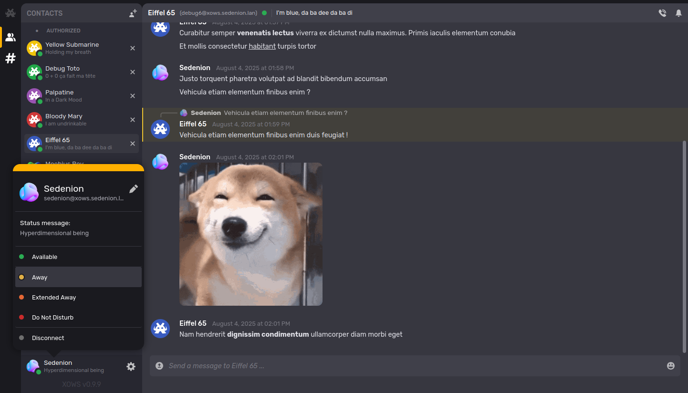

----------------------------------------------------------------------------------------
X.O.W.S
----------------------------------------------------------------------------------------

XMPP Over WebSocket

Version: 0.9.8 (beta with bugs)
----------------------------------------------------------------------------------------

Presentation
----------------------------------------------------------------------------------------
X.O.W.S (or XoWS) stands for "XMPP Over WebSocket" and is a Javascript XMPP web client 
that use the WebSocket protocole.

The main idea of the project is initially to create a XMPP client with the following 
caracteristics:
- Free from thirdparty library, lightweight and quick to load.
- Performant with low memory footprint.
- Allowing easy customisation and creation of graphical theme / web interface.
- Implementing features closer to modern chat clients like a one with name 
  beginning by "D".

The application is written in plain Javascript, in old-fashion (C-style) using many 
fcallbacks functions. The main code avoids as most as possible Javascript's false 
friends like the "this" keyword, anonymous functions, modern syntactic sugar and 
confusing (to me) paradigms such as Promises, "sync" and "async" mechanism.

Things that still to be Implemented/Fixed/Tested
----------------------------------------------------------------------------------------
 - Probably a lot of small bugs
 - Application main options via main screen (such as language selection)
 - A good Tutorial for deployment
 - Some code refactoring (especially on the GUI side)
 - A proper loading handling to avoid graphicals glitchs

Screenshots
----------------------------------------------------------------------------------------

The following screenshots are not up-to-date and do not reflect exactly the current 
stage of GUI.

Library architecture
----------------------------------------------------------------------------------------

The application is divided into several "API Modules" with one file per "module", each 
"module" is dedicated to a specific aspect of the program and have a dedicated function 
name prefix except the "base API". Here is module list and their quick description:

#### Low-Level API / "Back end" (Algorithms and protocole implemenation)

- `xows_base.js` **Base API**: Base constants and functions such as string/bytes manipulation and algorithms
- `xows_xml.js`  **XML Module**: XML parsing, manipulation and building functions
- `xows_sasl.js` **SALS Module**: SASL mechanism implementation
- `xows_sck.js`  **WebSocket Module**: WebSocket interface functions
- `xows_xmp.js`  **XMPP Module**: "Low-Level" XMPP protocol client interface

####  Mid-Level API (client interface)

- `xows_cach.js` **Caching Module**: Data caching and Browser local storage management functions
- `xows_load.js` **Agnostic loader**: Small toolset for loading tasks management and triggering
- `xows_cli.js`  **Client Module**: "High-level" XMPP client interface
- `xows_wrtc.js` **WebRTC Module**: WebRTC interface implementation

####  High-Level Program / "Front end" (GUI and "public" functions)

- `xows_l10n.js` **l10n Module**: Localization mechanisms and translation functions 
- `xows_tpl.js`  **HTML Templates Module**: HTML templates download and parsing mechanism
- `xows_doc.js`  **DOM Managment Module**: Browser DOM document management and GUI base tools
- `xows_gui.js`  **GUI Module**: GUI related functions and mechanisms
- `xows_init.js` **Init Module**: The main "Public" API and library initialization functions

