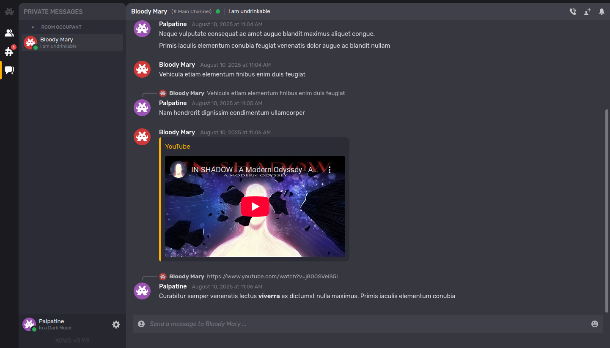

----------------------------------------------------------------------------------------
XOWS XMPP Web-Client
----------------------------------------------------------------------------------------

XMPP Over WebSocket

Version: 0.9.9 (it begins to have good shape)
----------------------------------------------------------------------------------------

Presentation
----------------------------------------------------------------------------------------
XOWS (or Xows) stands for "XMPP Over WebSocket", it is a JavaScript/HTML based XMPP
web client that use the WebSocket protocole.

It consist on a JavaScript application as main program with additional web
content (HTML, SVG images and fonts) for the interface.

It can be used simply by loading the JavaScript files (or the single minified
file) from a web page (typically, an index.html), then call the initialization
function from the HTML <script> element. Nothing more to do since the
application is designed to automatically load the additionnal web content from
the specified theme subfolder.

The initial idea of the project was to create an easy to install XMPP web client for
personal servers allowing to provide chat client in self-hosting context. The
focus was made on the following caracteristcs:
- Easy to install, in a "rustic" way (no docker, no DB, only web content)
- Easy to use, with modern chat client features and a pretty interface.
- Free from third party JavaScript library, lightweight and quick to load.
- Allowing customisation and creation of graphical theme / web interface.

It is better to mention that, since it is only a client, you will need to
connect it to an XMPP server to run it properly. It is up to you to use your
self-hosted XMPP server or to connect to any public XMPP server, however, it
is initially more self-hosting oriented.

Current stage of development
----------------------------------------------------------------------------------------
The application now implements the main required features that made it a modern
chat client. It is mainly focused on chats features to mimic what is offered by the
famous "D*****d" client, but in a way more rudimentary way. The main implemented
features are the following (features with '*' depend on XMPP server configuration):

- Instant messaging, to chat with friends and people you trust.
- Multi-User-Chat* (or Group Chat), to chat with strangers in IRC-like channels.
- File Upload*, to share image or data in chats (using XEP-0363 HTTP File Upload)
- Audio or Video calls (in duo/private only, based on XMPP Jingle and WebRTC).

More in details, here are the implemented chat features:

- Support for MarkDown styling in messages.
- Support for message deletion and correction.
- Support for message reply (reply-to) in chat context.
- Automatic embedding of images, video and audio.
- Automatic embedding of most popular video platforms.

Screenshots
----------------------------------------------------------------------------------------

One word about the code itself
----------------------------------------------------------------------------------------
The application is written in ECMAScript 6 JavaScript, BUT, in old-fashion (C style)
using many (almost exclusively) callback functions, avoding as most as possible
promises, arrow functions, (pseudo) classes and await/sync mechanism. That is, exactly
the opposite of what is recommended for "modern JavaScript".

I could enumerate many reasons why I am strongly refractaire to "modern javascript
syntax" and "way to do", but here is the main one : This has an huge impact on my
ability to write, READ and UNDERSTAND the code. I don't care the "callback hell",
I learned to code in C/C++ where callbacks are the only way and never being a
problem ("This is the way").

What I fear are unundestandable code, syntax sugar
that hides monstruous backstage implementations, classes that are actually not classes,
"strings" that are strings but not instances of String() and even sometimes arrays of
bytes, local variables that 'magically' pass from a function to another and APIs that
doesn't allow to pass a custom variable for callbacks.

Excepting such things, JavaScript is a pretty amusing toy.

